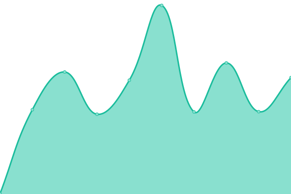

# [📈 Live Status](https://ssstuart.net): <!--live status--> **🟥 Complete outage**

This repository contains the open-source uptime monitor and status page for [SSStuart](https://ssstuart.net), powered by [Upptime](https://github.com/upptime/upptime).

With [Upptime](https://upptime.js.org), you can get your own unlimited and free uptime monitor and status page, powered entirely by a GitHub repository. We use [Issues](https://github.com/SSStuart/ssstuartnet-upptime/issues) as incident reports, [Actions](https://github.com/SSStuart/ssstuartnet-upptime/actions) as uptime monitors, and [Pages](https://ssstuart.net) for the status page.

<!--start: status pages-->
<!-- This summary is generated by Upptime (https://github.com/upptime/upptime) -->
<!-- Do not edit this manually, your changes will be overwritten -->
<!-- prettier-ignore -->
| URL | Status | History | Response Time | Uptime |
| --- | ------ | ------- | ------------- | ------ |
|  [ssstuart.net](https://ssstuart.net) | 🟥 Down | [ssstuart-net.yml](https://github.com/SSStuart/ssstuartnet-upptime/commits/HEAD/history/ssstuart-net.yml) | 

 952ms
     
 | 

<a href="https://SSStuart.github.io/ssstuartnet-upptime/history/ssstuart-net">99.61%</a>
    

|  [CQLJ](https://ssstuart.net/CQLJ) | 🟥 Down | [cqlj.yml](https://github.com/SSStuart/ssstuartnet-upptime/commits/HEAD/history/cqlj.yml) | 

 473ms
     
 | 

<a href="https://SSStuart.github.io/ssstuartnet-upptime/history/cqlj">99.62%</a>
    

|  [GTA 5 BB](https://gta5billboards.ssstuart.net/) | 🟥 Down | [gta-5-bb.yml](https://github.com/SSStuart/ssstuartnet-upptime/commits/HEAD/history/gta-5-bb.yml) | 

 1111ms
     
 | 

<a href="https://SSStuart.github.io/ssstuartnet-upptime/history/gta-5-bb">99.78%</a>
    

<!--end: status pages-->

[**Visit our status website →**](https://ssstuart.net)

## 📄 License

- Powered by: [Upptime](https://github.com/upptime/upptime)
- Code: [MIT](./LICENSE) © [Anand Chowdhary](https://anandchowdhary.com), supported by [Pabio](https://pabio.com)
- Data in the `./history` directory: [Open Database License](https://opendatacommons.org/licenses/odbl/1-0/)
